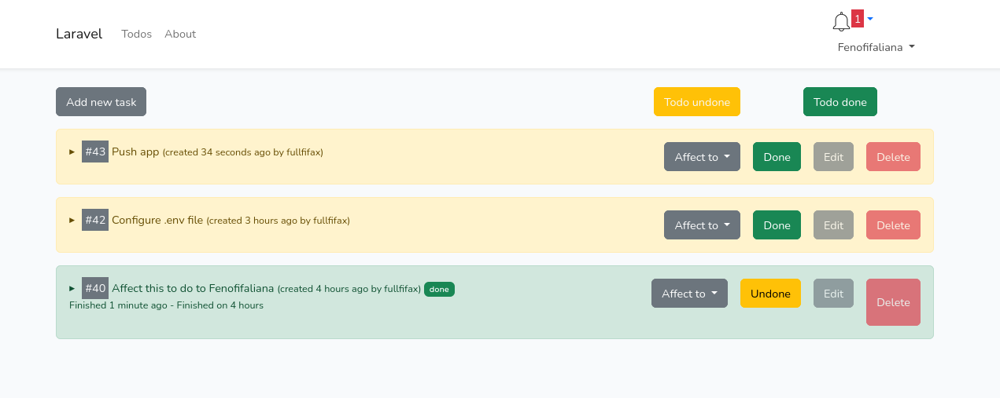

# kotrana-laravel

Simple to do list using laravel (with authentication + notification)

### Prerequisites
- Composer
- PHP 8
- phpmyadmin or its alternative

## Usage
Step 1: Clone this repository 
```
https://github.com/Fullfifax/kotrana-laravel.git
```
Step 2: Browse to your local repository
```
cd kotrana-laravel
```
Step 3: Configure .env 
```
#eg
DB_CONNECTION=mysql
DB_HOST=127.0.0.1
DB_PORT=3306
DB_DATABASE=db_name
DB_USERNAME=your_username
DB_PASSWORD=your_passwd

# to simulate a send mail to your local
# Change 
BROADCAST_DRIVER=smtp
# TO
BROADCAST_DRIVER=log
```
Step 4: Make migration
```
php artisan migrate
```
### Launch server
```
php artisan serve
# and new terminal tab and run
npm run dev
```
